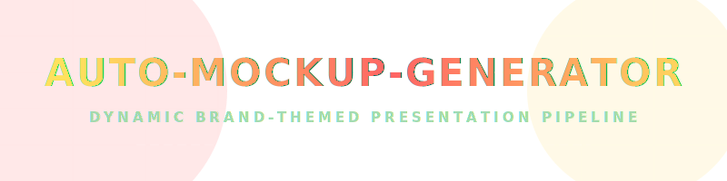
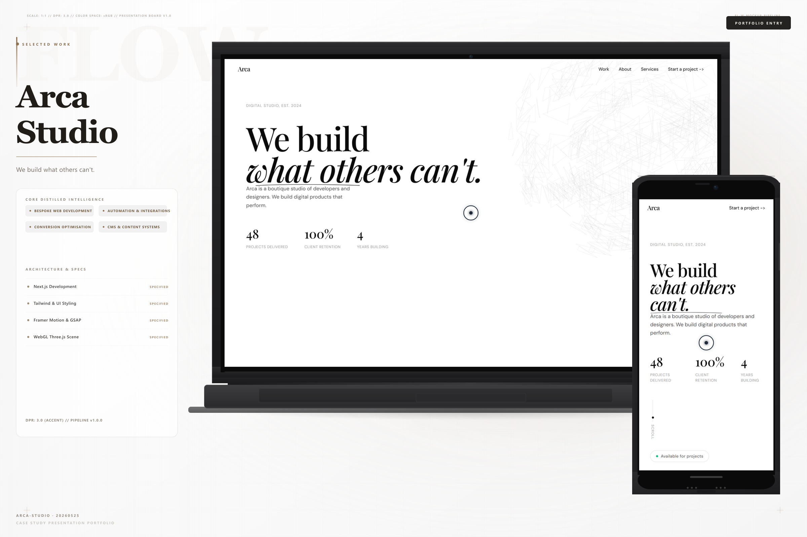
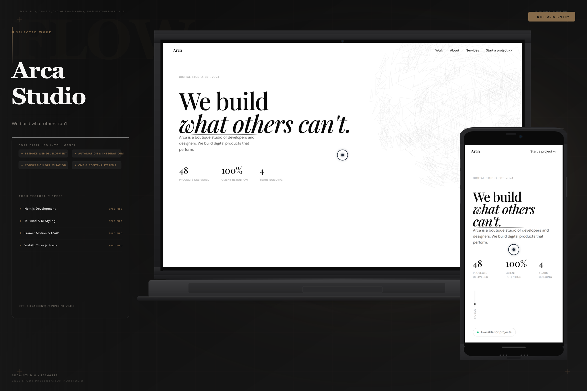
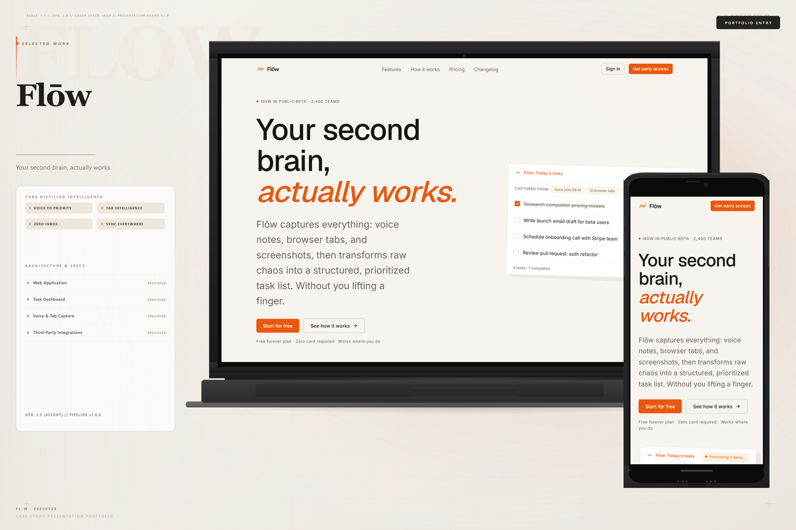
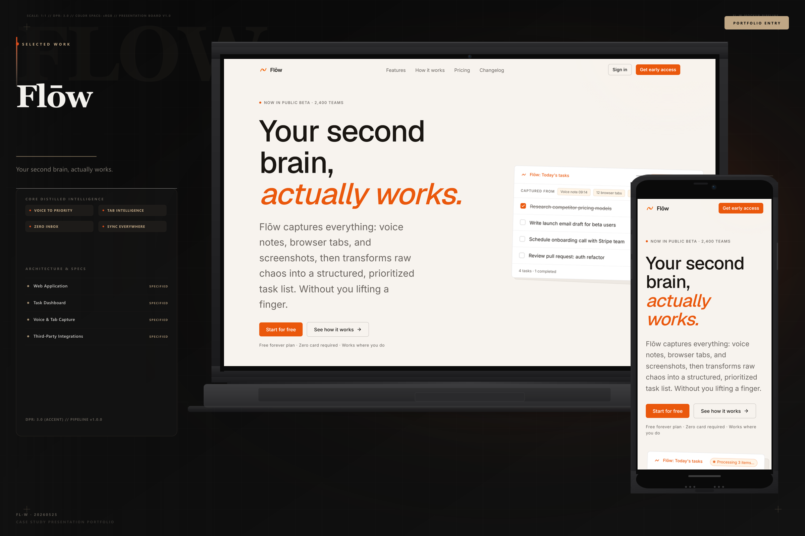

# <p align="center"></p>

<p align="center">
  <a href="https://github.com/Kushagra001/Auto-Mockup-Generator">
    
  </a>
  <a href="https://github.com/Kushagra001/Auto-Mockup-Generator/issues">
    
  </a>
  <a href="https://github.com/Kushagra001/Auto-Mockup-Generator/blob/main/LICENSE">
    
  </a>
</p>

<p align="center">
  <b>An automated, premium presentation-board generation pipeline. It captures live viewports, mathematically extracts their exact color DNA, and skins high-fidelity case study layouts dynamically.</b>
</p>

---

## 📸 Dynamic Presentation Gallery

### 🖤 Arca Studio (Hyper-Minimalist Monochrome)
> **Mathematical Essence:** Matte charcoal, cold white, minimal grid structure.

<p align="center">
  
  
</p>

### 💛 Axiom Strategy (Luxury Gold & Cream)
> **Mathematical Essence:** Warm champagne background, deep walnut text, premium luxury gold glowing highlights.

<p align="center">
  
  
</p>

### 💙 Flow (High-End Vibrant Cyan & Dark Purple)
> **Mathematical Essence:** Faint outline Georgia watermark `"FLOW"`, glassmorphic specification cards.

<p align="center">
  
  
</p>

---

## ⚡ Animated Pipeline Status

<p align="center">
  
</p>

---

## ✨ Features DNA

* **🎨 Algorithmic Color Extraction:** Crawls CSS values from pages, calculates contrasting text/panel tones, and outputs custom balanced glowing themes automatically.
* **🕵️ Self-Healing Viewport settling:** Injects runtime style rules to freeze Framer Motion transitions, GSAP scrolls, and layout-delay shifts.
* **📱 Unified Responsive Layouts:** Automatically stacks, centers, and clusters high-fidelity laptop and mobile frames in unified composite slide decks.

---

## 🛠️ Step-by-Step Execution

1. **Install dependencies:**
   ```bash
   npm install
   npx playwright install chromium
   ```

2. **Run Pipeline:**
   ```bash
   node scripts/generate.js \
     --url "https://arca-studio.vercel.app/" \
     --name "Arca Studio" \
     --tagline "We build what others can't." \
     --features "Bespoke Web Development, Automation & Integrations" \
     --deliverables "Next.js Development, Tailwind & UI Styling, Framer Motion" \
     --theme light
   ```
